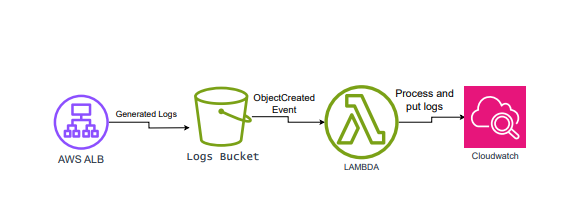

# AWS ALB Log Ingestion Pipeline

This repository contains an automated solution for processing AWS Application Load Balancer (ALB) access logs stored in S3 and sending them to AWS CloudWatch Logs for centralized monitoring and analysis. By using AWS Lambda, this pipeline automatically processes logs and pushes them to CloudWatch Logs in real-time, enabling better log management and faster troubleshooting for your web applications.

## Table of Contents
- [Architecture](#architecture)
- [Features](#features)
- [Setup](#setup)
- [Configuration](#configuration)
- [Usage](#usage)
- [License](#license)

## Architecture

The architecture consists of:
- **AWS ALB**: Generates access logs that are stored in an S3 bucket.
- **AWS S3**: Serves as the storage location for ALB logs. Logs are gzipped and organized in a date-based folder structure.
- **AWS Lambda**: Processes the log files from S3, decompresses them, and sends each log entry to CloudWatch Logs.
- **AWS CloudWatch Logs**: Centralized log storage where you can query, visualize, and set up alerts for your log data.

### Architecture Diagram



## Features

- **Automatic log processing**: ALB logs are automatically processed as they are uploaded to the S3 bucket.
- **Real-time log ingestion**: Logs are sent to CloudWatch Logs for real-time analysis and monitoring.
- **Batch processing**: Handles large log files and sends logs to CloudWatch in batches, staying within AWS size limits.
- **Scalability**: The Lambda function scales automatically based on the volume of logs, ensuring efficient processing.
- **Monitoring and alerting**: CloudWatch Logs makes it easy to set up monitoring dashboards, query logs, and create alerts for potential issues.

## Setup

### Prerequisites

1. **AWS Account**: Ensure you have an AWS account with the necessary IAM permissions to access S3, Lambda, and CloudWatch Logs.
2. **AWS CLI**: Install and configure the AWS CLI to interact with your AWS resources.
3. **Python 3.x**: This project uses Python 3.x for the AWS Lambda function code.

### Step-by-Step Setup

1. **Clone the repository**:

    ```bash
    git clone https://github.com/your-username/aws-alb-log-ingestion-pipeline.git
    cd aws-alb-log-ingestion-pipeline
    ```

2. **Create an S3 bucket** for ALB logs (if not already created):

    ```bash
    aws s3 mb s3://your-alb-log-bucket
    ```

3. **Enable ALB Logging**: Enable access logging for your ALB and configure it to send logs to the created S3 bucket.

4. **Deploy the Lambda function**:
   - Package the Lambda function code:

    ```bash
    zip lambda_function.zip lambda_function.py
    ```

   - Create the Lambda function:

    ```bash
    aws lambda create-function \
      --function-name alb-log-processor \
      --zip-file fileb://lambda_function.zip \
      --handler lambda_function.lambda_handler \
      --runtime python3.x \
      --role arn:aws:iam::your-account-id:role/your-lambda-execution-role
    ```

5. **Configure the S3 Event Trigger**:
   - Set up an S3 event notification to trigger the Lambda function when new log files are uploaded:

    ```bash
    aws s3api put-bucket-notification-configuration --bucket your-alb-log-bucket \
      --notification-configuration file://s3_notification_config.json
    ```

6. **CloudWatch Log Group**:
   - Ensure that the Lambda function has permissions to write logs to a CloudWatch Log Group. Create a log group if it does not exist:

    ```bash
    aws logs create-log-group --log-group-name /aws/alb/prodbox_alb
    ```

## Configuration

1. **Lambda Function Code**: The log processing code is located in `lambda_function.py`. It handles:
   - Fetching log files from S3.
   - Decompressing gzipped log files.
   - Sending log lines as events to CloudWatch Logs.
   - Handling batch sizes to avoid AWS limits for CloudWatch log event sizes.

2. **S3 Event Notification Configuration**:
   - The S3 bucket should be configured to notify the Lambda function when new logs are uploaded. A sample configuration is provided in `s3_notification_config.json`:

    ```json
    {
      "LambdaFunctionConfigurations": [
        {
          "LambdaFunctionArn": "arn:aws:lambda:region:account-id:function:alb-log-processor",
          "Events": ["s3:ObjectCreated:*"],
          "Filter": {
            "Key": {
              "FilterRules": [
                {
                  "Name": "prefix",
                  "Value": "AWSLogs/"
                },
                {
                  "Name": "suffix",
                  "Value": ".log.gz"
                }
              ]
            }
          }
        }
      ]
    }
    ```

## Usage

Once the setup is complete and the Lambda function is deployed, the following process will occur automatically:
- ALB generates logs and stores them in the S3 bucket.
- The S3 bucket triggers the Lambda function when a new log file is uploaded.
- The Lambda function fetches, processes, and sends the log entries to CloudWatch Logs.

### Monitoring Logs
You can view and query the processed logs in CloudWatch Logs:
1. Open the **AWS CloudWatch Console**.
2. Navigate to **Log Groups** and find the log group `/aws/alb/prodbox_alb`.
3. Use **CloudWatch Logs Insights** to query and analyze the logs.


